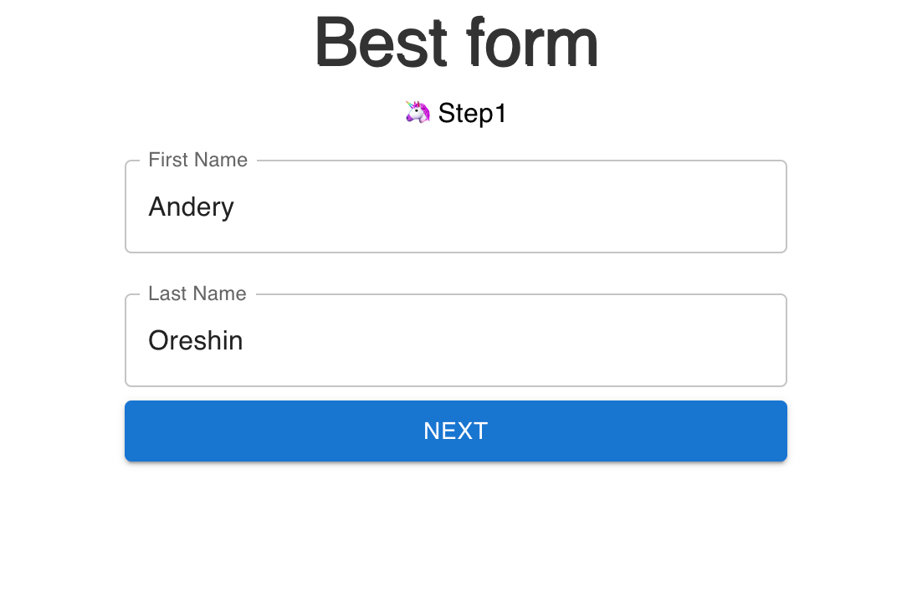
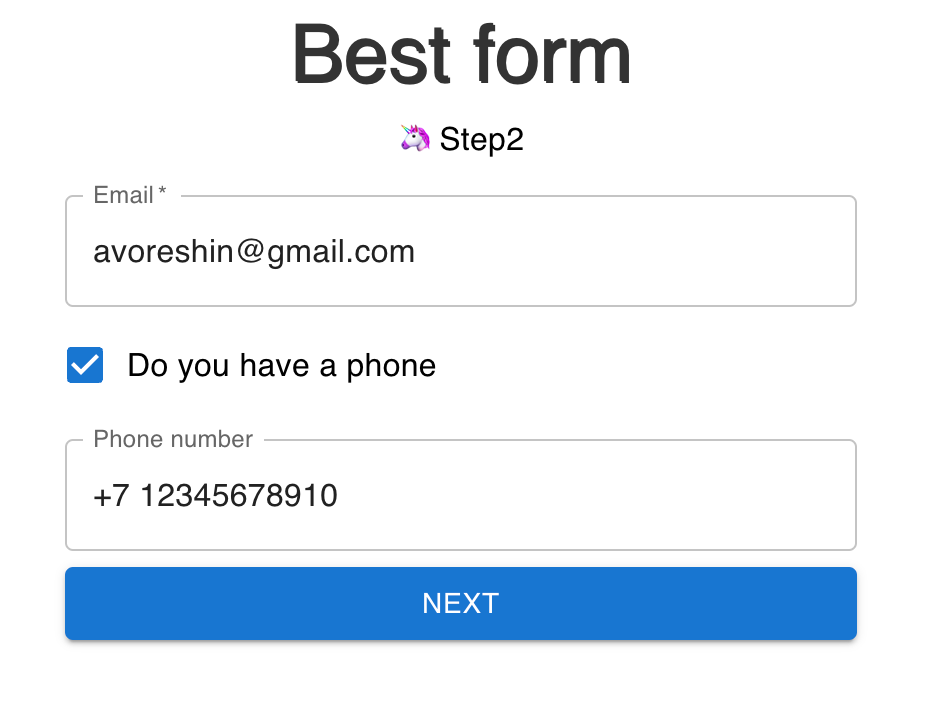
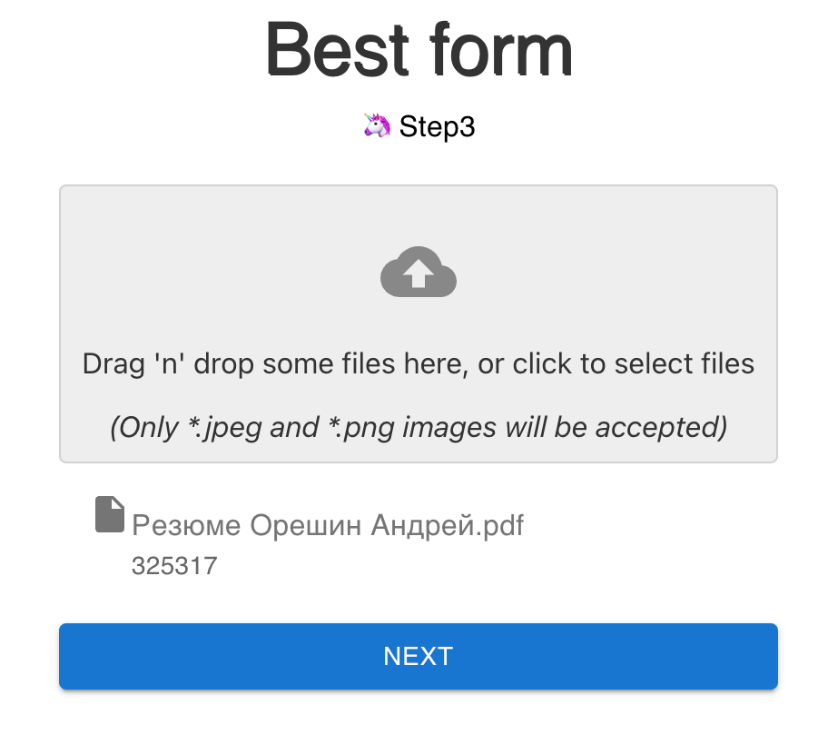
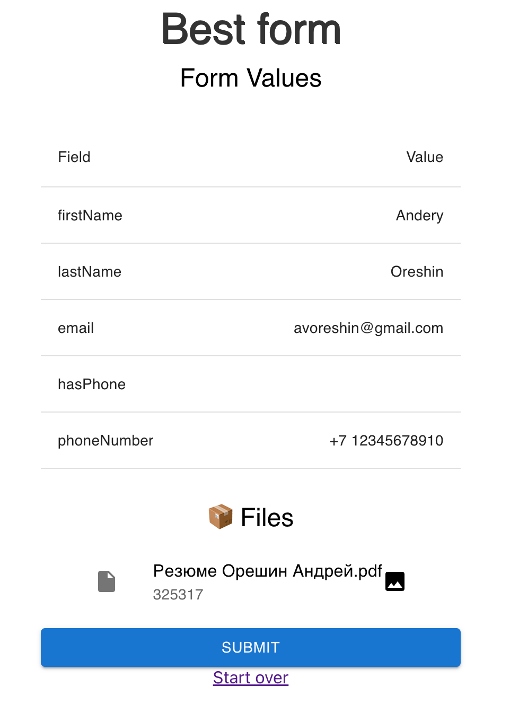

# Работа с формами с react-hook-form

В проекте использованиы библиотеки:

* hookform/resolvers": "^2.9.0",
* @mui/icons-material": "^5.8.4",
* "@mui/material": "^5.9.3",
* "libphonenumber-js": "^1.10.6",
* "react": "18.2.0",
* "react-confetti": "^6.1.0",
* "react-dom": "18.2.0",
* "react-dropzone": "^14.2.1",
* "react-hook-form": "^7.31.3",
* "react-router-dom": "^6.3.0",
* "sweetalert2": "^11.4.17",
* "web-vitals": "^2.1.4",
* "yup": "^0.32.11"

